# Section 1: Overview of Cloudera Dataflow

[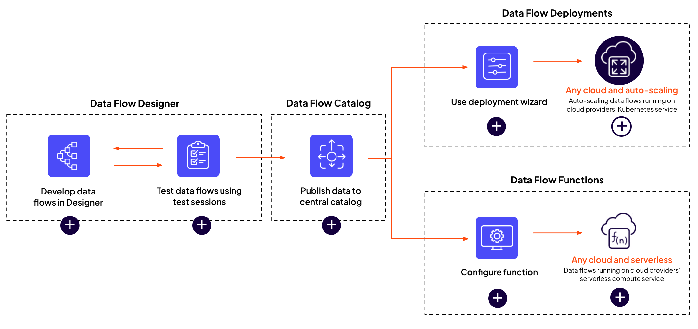](https://view.ceros.com/cloudera/flow-design-lifecycle-text?mobileHeightOverride=1361)

Cloudera Data Flow is a cloud-native universal data distribution service powered by Apache NiFi​​ that enables you to connect to any data source, process and deliver data to any destination. The cloud-native service enables self-serve deployments of Apache NiFi data flows from a central catalog into auto-scaling Kubernetes clusters, with centralized monitoring and alerting capabilities for the deployments. Let's familiarise ourselves with the Data Flow service.

### Agenda

* [Before Starting the Labs](#before-starting-the-labs)<br/>
* [Lab 1. Streaming Data Ingestion to Iceberg using Cloudera Data Flow](#lab-1-streaming-data-ingestion-to-iceberg-using-cloudera-data-flow)<br/>
  * [Overview of the Cloudera Data Flow Service](#overview-of-the-cloudera-data-flow-service)<br/>
  * [Deploy a Custom Data Flow Template](#deploy-a-custom-data-flow-template)<br/>
* [Lab 2. Machine Learning with Iceberg tables using Cloudera AI](#lab-2-machine-learning-with-iceberg-tables-using-cloudera-ai)<br/>
  * [Creating and Setting up your Cloudera AI Project](#creating-and-setting-up-your-cloudera-ai-project)<br/>
  * [Running Interactive Spark Session and Training and Tuning Models](#running-interactive-spark-session-and-training-and-tuning-models)<br/>
  * [Using JupyterLab to review the model output](#using-jupyterlab-to-review-the-model-output)<br/>
  * [Reviewing Model Run Experiments](#reviewing-model-run-experiments)<br/>
  * [Scheduling a Job in Cloudera AI](#scheduling-a-job-in-cloudera-ai)<br/>
  * [Delete CAI Project and Clean up resources](#delete-cai-project-and-clean-up-resources)<br/>
* [Lab 3. Data Visualization using Iceberg tables in Cloudera Data Warehouse](#lab-3-data-visualization-using-iceberg-tables-in-cloudera-data-warehouse)<br/>

## Before Starting the Labs

**Your instructor will run through each of the exercises giving you the oppotunity to view them go through it first. After that you'll be given time to go through each exercise on your own.**

Make sure you set a workload password for your assigned workload user i.e. user001.
Log into the **Cloudera Data Platform** -> Click your **Profile** Name at the bottom left of the Home Page and select **Profile**.


In your user's setting page, click **Set Workload Password**, enter any password twice and click the **Set Workload Password** button.


If all is good then we're ready to get on with using Iceberg across the Data Lifecycle!!!

## Lab 1. Overview of the Cloudera Data Flow Service

1. Go back to the Cloudera Control Plane web interface.
2. Click the **Data Flow** tile.

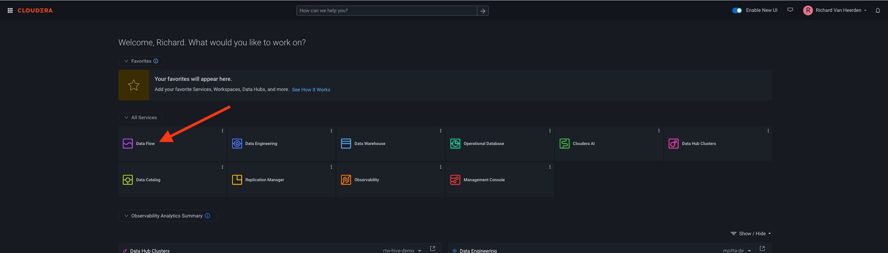

3. The Data Flow landing page will open in your browser which is the Overview menu item from the menu on the left side on the screen. This page provides quick access to Data Flow features and other resources, guides and releaes information.

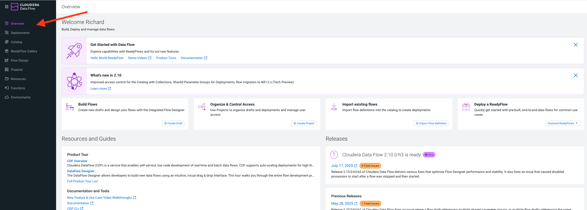

4. In the left hand menu select the next menu item **Deployments**. The Deployments page is the central place for managing and monitoring your Data Flow deployments running on Kubernetes and each executing a specific flow definition.

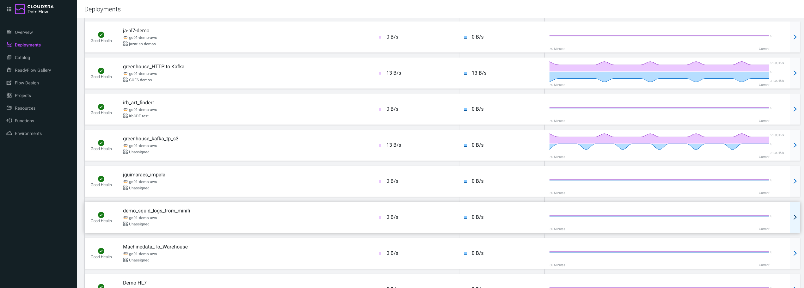

5. In the left hand menu select the next menu item **Catalog**. After building your flows, publish them to the central, version controlled catalog. From the catalog, you or your team members can create new deployments from the published flow definitions.

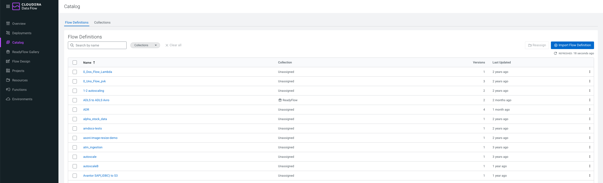   

6. In the left hand menu select the next menu item **ReadyFlow Gallery**. Cloudera Data Flow provides a growing library of ReadyFlows to get you started quickly. ReadyFlows are reference implementations of some of the most common data movement patterns in the industry.

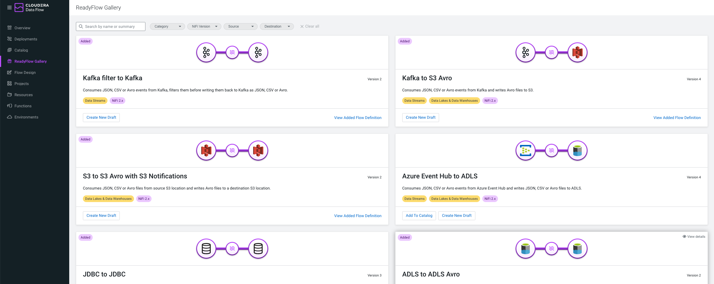

6. In the left hand menu select the next menu item **Flow Design**. Flow Design allows you to create, test, and deploy data pipelines using the Flow Designer. Which is a visual, no-code interface built on Apache NiFi. This interface enables developers to design data flows that move, transform, and route data across various systems. Users can start test sessions to run and validate flows in real-time, making iterative adjustments quickly and easily. 

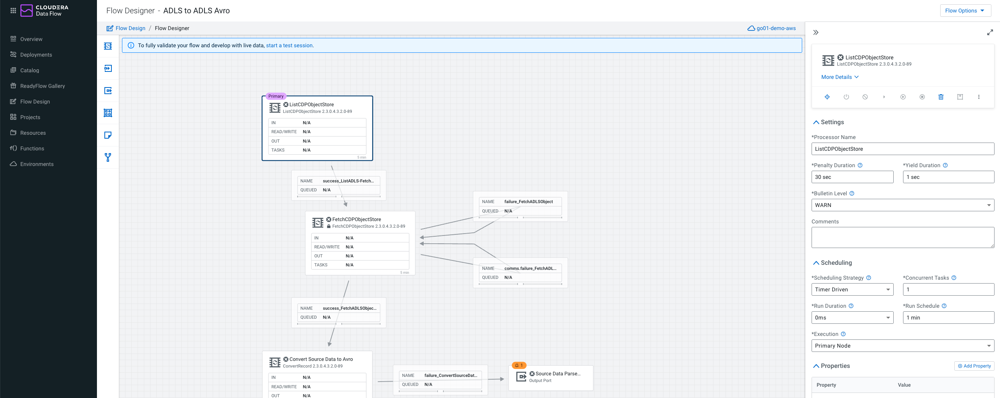

7. In the left hand menu select the next menu item **Projects**. Projects is a workspace management feature that helps you organize and manage your data flow developments.

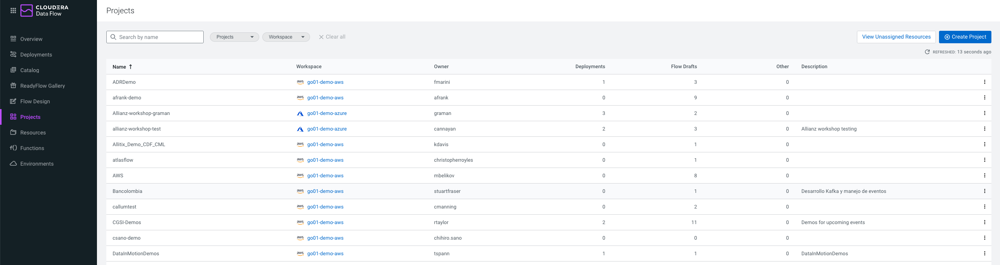

8. In the left hand menu select the next menu item **Resources**. Resources provide a high level overview of your various environments such as projects, deployments, drafts and other information in each.
 
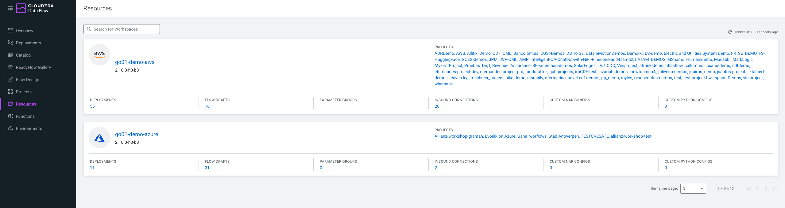

9. In the left hand menu select the next menu item **Functions**. Functions support running your data flows as serverless functions in AWS Lambda, Azure Functions and Google Cloud Functions. While auto-scaling deployments are great for low latency, high throughput data movement use cases, functions are ideal for event-driven or micro-batch related use cases where your flow does not have to be running 24/7.
 
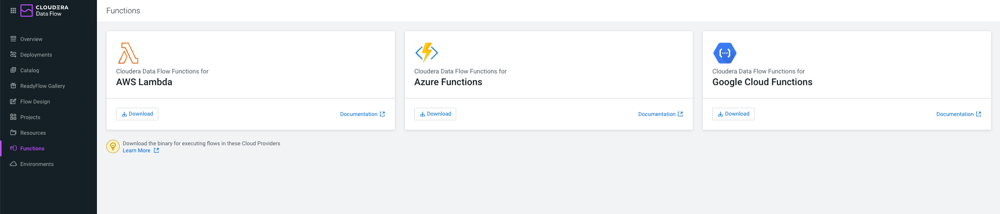

10. In the left hand menu select the next menu item **Environments**. Enviornments list all the automatically discovered enviornments in your Cloudera tenant and where Data Flow can be enabled or disbaled for each environment.

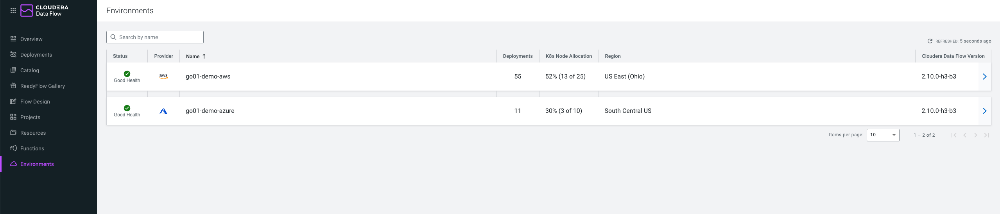

### Deploy a Custom Data Flow Template

Data Flow Templates make it easier to reuse and distribute data flows or specific parts of data flows. Besides reducing development time, reuse also supports the adoption of standards and patterns in data flow design. Data flow templates can help you to build a library of reusable elements that you can use as pre-built components in your new flows.

1. In the left hand menu select the next menu item **Catalog**. In the search field search for **hol-iceberg-populator**.
  


2. Click the flow name **hol-iceberg-populator** and a context window will appear on the right side of the screen. In this context window click the **Actions** dropdown button and select **Create New Draft**.


3. In the **Create New Draft** popup screen, select **nemea-hol-v2-cdp-env** for the **Target Namespace**, **Workshop** for the **Target Project** and **userxxx-hol-iceberg-populator** for the **Draft Name** substituting your assigned user id. Then click the **Create** button. This will display the **Test Session** config page. Accept all the default values and click the **Start Test Session** button.


4. A Flow Design canvas will open for you. At the top right of the screen click **Flow Options**, and under that **Test Session** section click the **Start** button. This is going to spin up resource container for us to build our flow.


5. After the Test Session has initialised, at the top right of the screen click **Flow Options**, and under that click on **Parameters**. 


6. On the **Parameters** screen, set the parameters values as indicated below substituting your assigned user id and password. Click the **Apply** button after making the changes and ignore any warnings messages.
 * CDP Workload User: **userxxx**
 * CDP Workload User Password: **userxxx_password**


7. At the top right of the screen click **Flow Options** again, and under that click on **Services**.


9. On the Services page, click on each disabled services and click the Enable button for each one. After unebaling they should all have a green check icon next to them :white_check_mark:.


10. Go back to the Flow Designer canvas but clicking **Flow Designer** in the path breadcrumb amd let's start building our flow. You'll se an existing ExecuteContent processor on the canvas already. This is one we're already create for you to reuse that generates synthetic data. Typically this data would be coming from a source like Kafka, database system or IOT device. 


11. On the tool menu on the left drag and drop a **Processor** tool onto your canvas. A popup will appear where you enter **MergeContent** into the search bar. Once it's found the **MergeContent** processor click the **Add** button to add it to your canvas.


12. **Repeat** the same process to add a **PutIceberg** processor to your canvas.
    
13. Drag and drop the two new processors to align them neatly on your canvas in the order **ExecuteContent -> MergeContent -> PutIceberg**. Now move your cursor to the bottom right of each processor, clicking the arrow area and dargging and dropping the arrow to the processor you want to connect it to as shown below. For the **ExecuteContent -> MergeContent** connection select the condition of **Success** for the link and for the  **MergeContent -> PutIceberg** connection select the condition of **Merged** for the link.


14. On the canvas select the **MergeContent** processor. In the conext window on the right set the following **Properties** and **Relationships** values for the processor:
     * Properties:
       * Minimum Number of Entries: 10
     * Relationships:
       * failure: Terminate
       * original: Terminate
    Click the **Apply** button at yhe bottom of the Processor context window. 


15. On the canvas select the **PutIceberg** processor. In the conext window on the right set the following **Properties** and **Relationships** values for the processor:
     * Properties:
       * Record Reader: JsonTreeReader (select from dropdown)
       * Catalog Service: HiveCatalogService (select from dropdown)
       * Catalog Namespace: Select the ellipses &#10247;and select **Convert to Parameter**. In the **Add Parameter** popup, enter **default** into the **Value** field and click **Apply** button.
       * Table Name: Select the ellipses &#10247;and select **Convert to Parameter**. In the **Add Parameter** popup, enter **userxxx_laptop_data** into the **Value** field substituting your assigned user id and click **Apply** button.
       * Kerberos User Service: KerberosPasswordUserService (select from dropdown)
     * Relationships:
       * failure: Terminate
       * original: Terminate
  Click the **Apply** button at yhe bottom of the Processor context window. 


16. On the canvas right click the **ExecuteScript** processor and select the **Start** option.


17. You should notice the **ExecuteScript** processor changes icon status to green meaning it's running and you should see flowfiles accumulating in the **Success** relationhip. Right click on the **Success** relationship block and select the **List Queue** option.


18. We can inspect the flowfiles that have been generated in the Queue by selecting any of the folowfile records and clicking on the **Open Data in Viewer** icon. Take a look at the data that is being generated across the different flowfiles.


19. On the canvas right click the **MergeContent** processor and select the **Start** option. Right click on the **mergecontent** relationship block and select the **List Queue** option. As in the step before look at the data in the flowfile and notice how it's merged the the original flowfiles into a larger flowflow based on the settings configured in the **MergeContent** processor.


20.  On the canvas right click the **PutIceberg** processor and select the **Run Once** option. This is a reallyt interesting feauture about Nifi where you can develop on the fly and control flowfiles between Processors individually while building and testing your flow without having to recomplie anything.


21. If no warnings appear on the **PutIceberg** processor we can go to Hue SQL IDE and check we are getting data into our Iceberg table. See if you can remember how to to do this
> [!TIP] 
> **Data Warehouse** tile -> **Open Data Warehouse** -> **Virtual Warehouses** -> **workshop-impala-vw** -> **Hue**

```ruby
select * from default.${username}_laptop_data;
```


22. Finally go back to your **Flow Designer** canvas and right click the **PutIceberg** processor and select the **Start** option. Our flow is running fully now and will continue to stream data into our Iceberg table. Typically we would productionise our flow by publishing it back to the **Catalog** and creating a **Deployment** it onto an autoscaling Kubernetes containers where it can be centrally monitored. But for the purposes of this hands-on lab we can leave it running in the Test Session.


