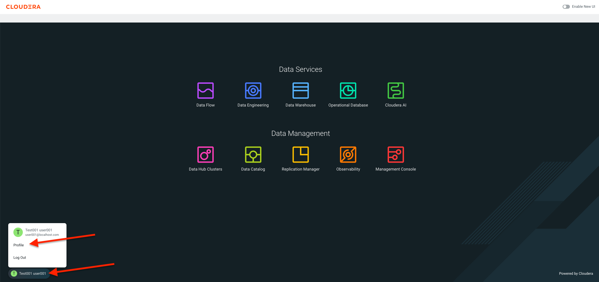
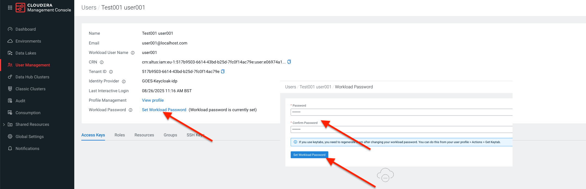

# Section 1: Overview of Cloudera Dataflow

Cloudera Data Flow is a cloud-native universal data distribution service powered by Apache NiFi​​ that enables you to connect to any data source, process and deliver data to any destination. The cloud-native service enables self-serve deployments of Apache NiFi data flows from a central catalog into auto-scaling Kubernetes clusters, with centralized monitoring and alerting capabilities for the deployments. Let's familiarise ourselves with the Data Flow service.

## Before Starting the Labs

**Your instructor will run through each of the exercises giving you the oppotunity to view them go through it first. After that you'll be given time to go through each exercise on your own.**

Make sure you set a workload password for your assigned workload user i.e. user001.
Log into the **Cloudera Data Platform** -> Click your **Profile** Name at the bottom left of the Home Page and select **Profile**.

In your user's setting page, click **Set Workload Password**, enter any password twice and click the **Set Workload Password** button.

If all is good then we're ready to get on with using Iceberg across the Data Lifecycle!!!

## Lab 1. Overview of the Cloudera Data Flow Service

1. Go back to the Cloudera Control Plane web interface.
2. Click the **Data Flow** tile.

3. The Data Flow landing page will open in your browser which is the Overview menu item from the menu on the left side on the screen. This page provides quick access to Data Flow features and other resources, guides and releaes information.

4. In the left hand menu select the next menu item **Deployments**. The Deployments page is the central place for managing and monitoring your Data Flow deployments running on Kubernetes and each executing a specific flow definition.

5. In the left hand menu select the next menu item **Catalog**. After building your flows, publish them to the central, version controlled catalog. From the catalog, you or your team members can create new deployments from the published flow definitions.

   

6. In the left hand menu select the next menu item **ReadyFlow Gallery**. Cloudera Data Flow provides a growing library of ReadyFlows to get you started quickly. ReadyFlows are reference implementations of some of the most common data movement patterns in the industry.

6. In the left hand menu select the next menu item **Flow Design**. Flow Design allows you to create, test, and deploy data pipelines using the Flow Designer. Which is a visual, no-code interface built on Apache NiFi. This interface enables developers to design data flows that move, transform, and route data across various systems. Users can start test sessions to run and validate flows in real-time, making iterative adjustments quickly and easily. 

7. In the left hand menu select the next menu item **Projects**. Projects is a workspace management feature that helps you organize and manage your data flow developments.

8. In the left hand menu select the next menu item **Resources**. Resources provide a high level overview of your various environments such as projects, deployments, drafts and other information in each.
 

9. In the left hand menu select the next menu item **Functions**. Functions support running your data flows as serverless functions in AWS Lambda, Azure Functions and Google Cloud Functions. While auto-scaling deployments are great for low latency, high throughput data movement use cases, functions are ideal for event-driven or micro-batch related use cases where your flow does not have to be running 24/7.
 

10. In the left hand menu select the next menu item **Environments**. Enviornments list all the automatically discovered enviornments in your Cloudera tenant and where Data Flow can be enabled or disbaled for each environment.

